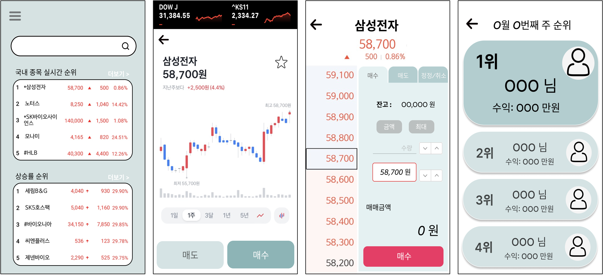
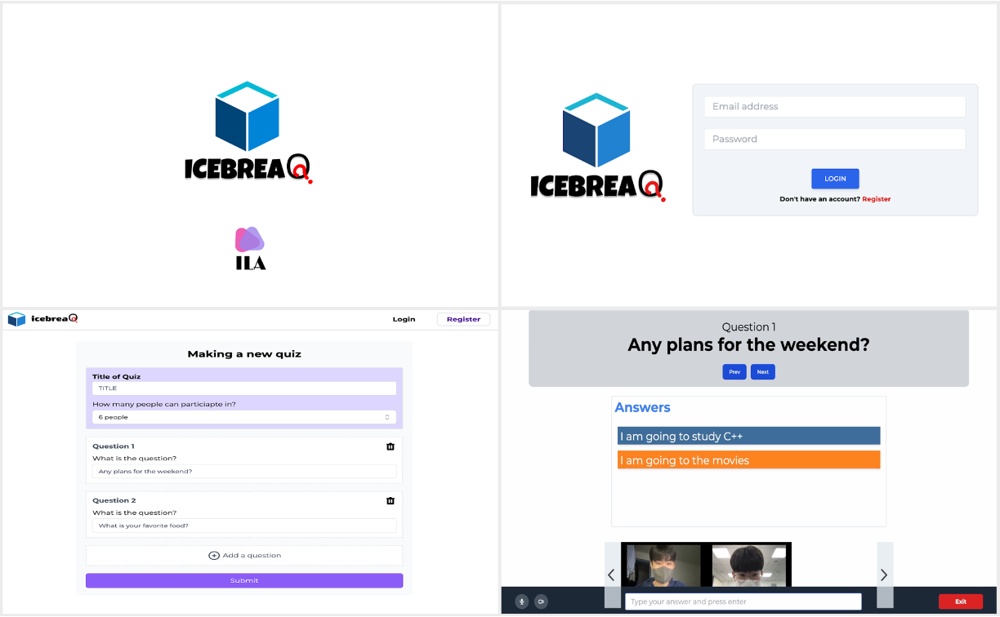

---
permalink: /about/
title: "About Me"
excerpt: "About Me"
search: true
last_modified_at: 2023-01-08T13:00:00+09:00
toc: true
toc_sticky: true
toc_label: "About Me"

--- 

## Profile

Hi, my name is Hongchan Jeon, an undergraduate student in Korea University.

I am looking forward to be a Software developer.

To introduce myself more, I have so many hobbies, so maybe I can say my hobby is to try new things.

<b><a style="color: #900023; text-decoration: none;">Here's some of my unique hobbies:</a></b>

       

- customizing keyboards
- I breed reptiles e.g. crested gecko, ball python
- I love music. I can play many instruments e.g. piano, drum
- self-interior

## Education
- **Undergraduate** in Computer Science and Engineering at <a href="https://www.korea.edu/mbshome/mbs/en/index.do" style="color: #900023; text-decoration: none;">**Korea University**</a> \\
Mar. 2018 - current 

## Project Experience
- **Computer Programming**\\
Developed a Windows application <a href="https://github.com/chany63/ChanyProject" style="color: #900023; text-decoration: none;">**Dormitory Delivery Service**</a> using Java in Computer Programming class(COSE102) at Korea University.\\
Here's the <a href="https://youtu.be/UxVXHnrtQHQ" style="color: #900023; text-decoration: none;">**Demo Video**</a> of using the app service.\\
Sep. 2018 - Nov. 2018

- **Hanium** \\
Participated in <a href="https://www.hanium.or.kr/" style="color: #900023; text-decoration: none;">**Hanium**</a> project competition as a Backend Developer under the theme of making a Stock-Trading app.\\
Apr. 2021 - Dec. 2022

- **Software Security** \\
Developed a Web application <a href="https://github.com/Team-ILA/icebreaQ-server" style="color: #900023; text-decoration: none;">**icebreaQ**</a> as a Backend Developer in Software Security class(COSE451) at Korea University especially the feature of user management(login, logout, register).\\
Participated in a git CTF(<a href="../icebreaQ.pdf" style="color: #900023; text-decoration: none;">**icebreaQ-Report**</a>) about the software vulnerabilities of each other's projects.\\
Here's the <a href="https://www.rwb0104.tk/" style="color: #900023; text-decoration: none;">**Demo Site**</a> and <a href="https://youtu.be/X4PaFwVboRs" style="color: #900023; text-decoration: none;">**Demo Video**</a>.\\
Aug. 2022 - Dec. 2022

## Further Career
- **Gifted Education Center** \\
Participated as a tutor in <a href="https://ku-gifts.kr" style="color: #900023; text-decoration: none;">**Gifted Education Center**</a> teaching students under the theme of Metaverse, 3D printing, Drones, AI autonomous car, VR, etc.\\
Dec. 2022 - current

- **LG Aimers** \\
Participated as a 2'nd trainee at <a href="https://www.lgaimers.ai/" style="color: #900023; text-decoration: none;">**LG Aimers**</a> and prepared to compete in LG AI Hackathon.\\
Jan. 2023 - current

## Technology Stacks

<b><a style="color: #900023; text-decoration: none;">Tech Stacks Experienced:</a></b>

       

- Python, C
- postgreSQL
- mongoDB
- React
- Java
- AWS(EC2)

<b><a style="color: #900023; text-decoration: none;">Tech Stacks Studying:</a></b>

       

- Nodejs, javascript(+typescript): Experienced(<a href="https://github.com/Team-ILA/icebreaQ-server" style="color: #900023; text-decoration: none;">**icebreaQ**</a>) but not used to it
- React-Native

## Contact
 * Email : <a href="mailto:chany63@korea.ac.kr" style="color: #900023; text-decoration: none;">**chany63@korea.ac.kr**</a>
 * Github : <a href="https://github.com/chany63/" style="color: #900023; text-decoration: none;">**https://github.com/chany63/**</a>
 * Blog : <a href="https://chany63.github.io/" style="color: #900023; text-decoration: none;">**https://chany63.github.io/**</a>
