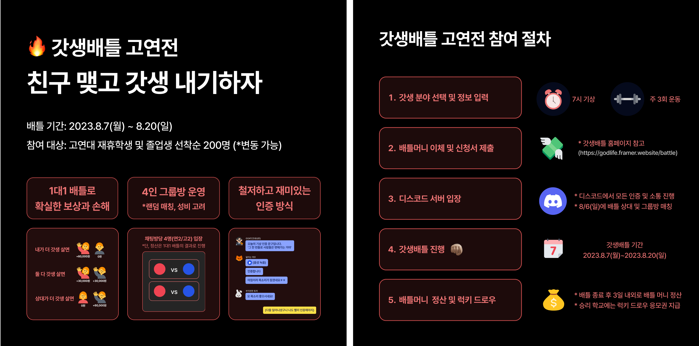

## Profile

Hi, my name is Hongchan Jeon, an undergraduate student in Korea University.

I am a Software developer and looking forward to be a Backend Developer

To introduce myself more, I have so many hobbies, so maybe I can say my hobby is to try new things.

<b><a style="color: #900023; text-decoration: none;">Here's some of my unique hobbies:</a></b>

- customizing keyboards
- I love music. I can play many instruments e.g. piano, drum
- self-interior
- I love sports like Bowling, Climbing

## Education

- **Undergraduate** in Computer Science and Engineering at <a href="https://www.korea.edu/mbshome/mbs/en/index.do" style="color: #900023; text-decoration: none;">**Korea University**</a> \\
  Mar. 2018 - current

## Project Experience

- **Computer Programming**\\
  Developed a Windows application <a href="https://github.com/chany63/ChanyProject" style="color: #900023; text-decoration: none;">**Dormitory Delivery Service**</a> using Java in Computer Programming class(COSE102) at Korea University.\\
  Here's the <a href="https://youtu.be/UxVXHnrtQHQ" style="color: #900023; text-decoration: none;">**Demo Video**</a> of using the app service.\\
  Sep. 2018 - Nov. 2018

- **Hanium** \\
Participated in <a href="https://www.hanium.or.kr/" style="color: #900023; text-decoration: none;">**Hanium**</a> project competition as a Backend Developer under the theme of making a Stock-Trading app.\\
Apr. 2021 - Dec. 2022

- **Software Security** \\
Developed a Web application <a href="https://github.com/Team-ILA/icebreaQ-server" style="color: #900023; text-decoration: none;">**icebreaQ**</a> as a Backend Developer in Software Security class(COSE451) at Korea University especially the feature of user management(login, logout, register).\\
Participated in a git CTF(<a href="../icebreaQ.pdf" style="color: #900023; text-decoration: none;">**icebreaQ-Report**</a>) about the software vulnerabilities of each other's projects.\\
Here's the <a href="https://www.rwb0104.tk/" style="color: #900023; text-decoration: none;">**Demo Site**</a> and <a href="https://youtu.be/X4PaFwVboRs" style="color: #900023; text-decoration: none;">**Demo Video**</a>.\\
Aug. 2022 - Dec. 2022

- **Capston Competition** \\
Participated in the **Capston Competition**, which was hosted by Korea University, as **Team-OnMyWay** and won the **First-Place** award.\\
Developed a mobile application <a href="https://apps.apple.com/pl/app/onmyway-%EA%B2%BD%EB%A1%9C-%EC%A3%BC%EB%B3%80-%EC%9E%A5%EC%86%8C-%EA%B2%80%EC%83%89%EC%9D%84-%ED%95%9C%EB%88%88%EC%97%90/id6503656527" style="color: #900023; text-decoration: none;">**OnMyWay**</a> as a Frontend Developer using React-Native(Typescript) and the Naver-Map api.
Here is the poster(<a href="../omw.pdf" style="color: #900023; text-decoration: none;">**OMW-Poster**</a>) that we presented in the competition.\\
Mar.2024 - Jun.2024

## Further Career

- **Gifted Education Center** \\
  Participated as a tutor in <a href="https://ku-gifts.kr" style="color: #900023; text-decoration: none;">**Gifted Education Center**</a> teaching students under the theme of Metaverse, 3D printing, Drones, AI autonomous car, VR, etc.\\
  Dec. 2022 - Feb. 2023
  

  

  

- **LG Aimers** \\
  Participated as a 2'nd trainee at <a href="https://www.lgaimers.ai/" style="color: #900023; text-decoration: none;">**LG Aimers**</a> and prepared to compete in LG AI Hackathon.\\
  Jan. 2023 - Feb. 2023

- **WHYNOTEDU Co.** \\
  Worked as a Software Developer & Product Manager at a startup company called **WHYNOTEDU Co.**.\\
  Managed several new MVPs including **갓생배틀**, which I managed and planned myself and also developed the whole Backend(NestJS) of the MVP using the cron mechanism and discord api.\\
  Feb. 2023 - Aug. 2023
  

  

  

- **Team Kairos** \\
  Participated as a Frontend Developer in a startup team called **Team Kairos**.\\
  Developed the Frontend(NextJS) of <a href="https://stcl-front-kairos-dev.vercel.app/" style="color: #900023; text-decoration: none;">**StylingCloud**</a> which is a connection platform between the designer and the client.\\
  Sep. 2023 - Mar. 2024
  

  

  

- **LOADIT Co.** \\
  Worked as a Software Developer at **LOADIT Co.**
  Managed the MYSQL database of the **LOADIT**'s Integrated Data Service for Global E-Commerce Business including the DAGS code for the daily batch process.\\
  Developed new features and modified the Frontend(vue2) & Backend(python) code in response to CS.\\
  May. 2024 - Nov. 2024

<!-- ## Technology Stacks

<b><a style="color: #900023; text-decoration: none;">Tech Stacks Experienced:</a></b>

- Python, C
- postgreSQL
- mongoDB
- React
- Java
- AWS(EC2)

<b><a style="color: #900023; text-decoration: none;">Tech Stacks Studying:</a></b>

- Nodejs, javascript(+typescript): Experienced(<a href="https://github.com/Team-ILA/icebreaQ-server" style="color: #900023; text-decoration: none;">**icebreaQ**</a>) but not used to it
- React-Native

 -->

## Contact

- Email : <a href="mailto:chany63@naver.com" style="color: #900023; text-decoration: none;">**chany63@naver.com**</a>
- Github : <a href="https://github.com/chany63/" style="color: #900023; text-decoration: none;">**https://github.com/chany63/**</a>
- Blog : <a href="https://chany63.github.io/" style="color: #900023; text-decoration: none;">**https://chany63.github.io/**</a>
